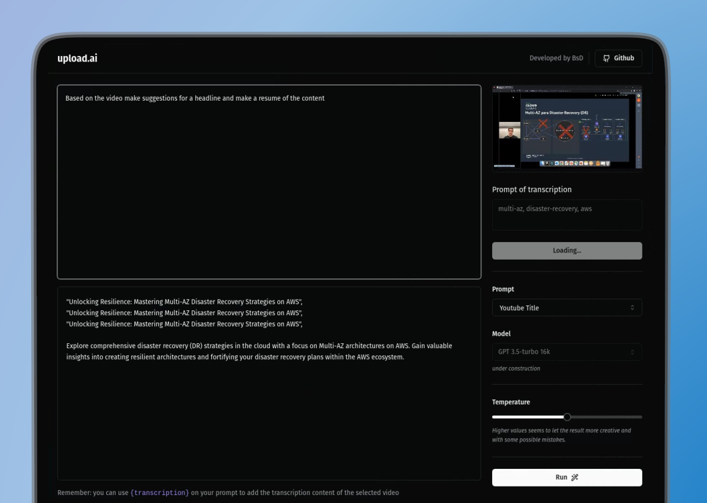

 <h1 align="center">upload.ai</h1>
<br />
<p align="center"> 
   
	 
  	<a href="https://github.com/brunosduarte/upload-ai/commits/master"> 
   		 
 	</a> 
  	<a href="https://opensource.org/licenses/MIT"> 
   		 
  	</a> 
</p>


## 🗂 Contents


- 📋 [Project](#-project)
  - 🚀 [Technologies](#-technologies)
  - 📷 [Preview](#-preview)
- 📦 [Instalation](#-instalation)
- ⚖️ [License](#%EF%B8%8F-license)
- 📫 [Contact](#-contact)


## 📋 Project

This innovative project, developed during the nlw-IA event led by Diego Fernandes from Rocketseat, aims to create a web application that leverages cutting-edge artificial intelligence to analyze and extract key data from videos in an automated manner.

### 🚀 Technologies

[](https://openai.com)
[](https://ffmpeg.org)
[](https://www.radix.com)
[](https://www.tailwindcss.com)
[](https://www.fastify.dev)
[](https://www.zod.dev)
[](https://www.prisma.io)
[](https://www.axios-http.com)
[](https://www.typescriptlang.org)

## 📷 Preview

##### 💻 frontend:

<p align="center"> 
  
</p>

## 📦 Instalation

To clone and run this application, you will need [Git][git], [NodeJS v18.17.1][nodejs] or higher + [npm v9.17.1][npm] or higher, and [PNPm 8.7.5][pnpm] installed on your computer. In your terminal, run:


```bash
# Cloning repo
$ git clone https://github.com/brunosduarte/nlw-ia.git nlw-ia
```

```bash
# Installing pnpm
$ npm install -g pnpm
```

```bash
# Backend

# Go to the repository
$ cd server

# Install the dependencies
$ pnpm i

# Create migrations
$ pnpm prisma migrate dev


# Note: After running the command above, you will be prompted to enter the migration name. You can use the following name: "create videos and prompts"

----------------------------------------------------------------------------------------------------------------------------------------
# Before running the API, change the .env.example to .env and add your OpenAI API key to the .env file
----------------------------------------------------------------------------------------------------------------------------------------

# Run the API
$ pnpm run dev

# Note: After running the command above, the API will be available at http://localhost:3333

```

```bash
# Frontend

# Got to the repository
$ cd web

# Install dependencies
$ pnpm i

# Execute
$ pnpm run dev
```


## ⚖️ License

This project is under license. [MIT](LICENSE).


## 📫 Contact

by [**Bruno Duarte**](https://www.linkedin.com/in/brunosduarte/) 🚀


[nodejs]: https://nodejs.org/
[PNPm]: https://pnpm.io/pt/
[npm]: https://www.npmjs.com/
[git]: https://git-scm.com
